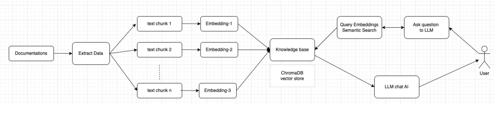

## ArticleMind ChatBot

### Introduction:

In this project, we utilize the API provided by LangChain to leverage large language models offered by companies like OpenAI and Google. With this setup, our chatbot can read documents provided by the user and answer professional questions from within them. One noteworthy aspect is that our bot can retain memory of previous questions, allowing users to seek answers more conveniently.

The chatbot is presented as a web application, consisting of a frontend directory and a backend program directory.


### Step 1: OpenAI ChatGPT Configuration:

In `chatbot-server/` directory, create `docs` folder and `.env` file:
- docs
    ```
    cd chatbot-server
    mkdir docs
    ```
    Move the documentation that you want the chatbot to learn into the docs folder.
- .env
    ```
    OPENAI_API_KEY = '<YOUR KEY>'
    OPENAI_MODEL=gpt-4
    EMBEDDING_MODEL=text-embedding-ada-002
    ```


### Step 2: Install python package:

First, navigate to the "chatbot-server" directory and install Python packages listed in `requirements.txt`. **Python version 3.8 or higher is required**.
    
```
pip install -r requirements.txt
```
    

### Step 3: Activate Backend Server

After completing the configuration, start the backend service, including the conversation chain:

```
python3 main.py
```


### Step 4: Activate Frontend GUI

Once the backend is running, enable the frontend GUI. Navigate to the "chatbot-gui" directory:

```bash
pnpm install
pnpm start
```


### How to use the api to config chatbot
1. Merge Docs
    ```
    curl -X POST "http://localhost:3035/documents/merge-docs"
    ```
    Merge all documentation in docs folder into one md file.
2. Create Embeddings
    ```
    curl -X POST "http://localhost:3035/embedding/create-embeddings"
    ```
    Create embeddings to serve as the chatbot's knowledge base. 
