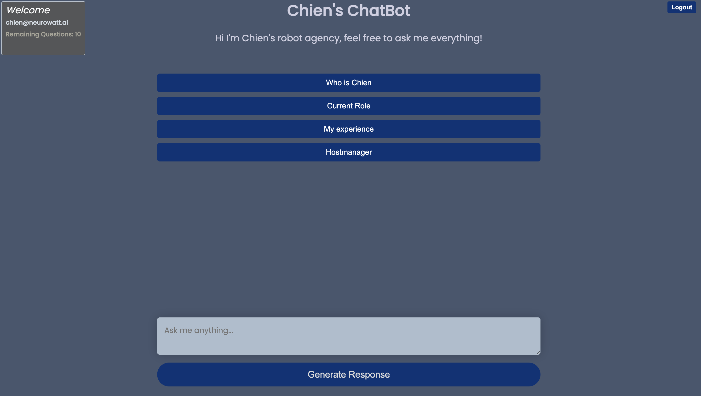
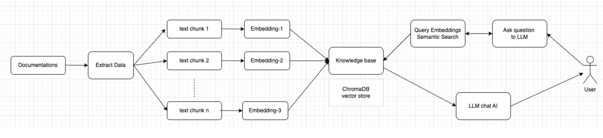

## ArticleMind ChatBot

### Introduction:

In this project, we utilize the API provided by LangChain to leverage large language models offered by companies like OpenAI and Google. With this setup, our chatbot can read documents provided by the user and answer professional questions from within them. One noteworthy aspect is that our bot can retain memory of previous questions, allowing users to seek answers more conveniently.

To know how to host the website for free, read this article [Step-by-Step Guide to Hosting a Full-Stack App for Free](https://medium.com/@pong861013/step-by-step-guide-to-hosting-a-full-stack-app-for-free-1-built-cloud-infrastructure-0fef87e3140a)

### [👉🏻 Live Demo](https://articlemind.ddns.net/login)


The chatbot is presented as a web application, consisting of a frontend directory and a backend program directory.



## 🚀 VM Deployment Guide

This branch (`vm-deployment`) is specifically configured for VM deployment with Docker and Nginx.

### Prerequisites:
- Ubuntu/Debian VM with Docker and Docker Compose installed
- Domain name with DNS pointing to your VM
- SSL certificate (Let's Encrypt recommended)

### Quick Start with Docker:

1. **Clone and setup:**
```bash
git clone <repository-url>
cd ArticleMind-Chat-LangChain
git checkout vm-deployment
```

2. **Configure environment variables:**
```bash
# Backend configuration
cp chatbot-server/.env_example chatbot-server/.env
# Edit chatbot-server/.env with your API keys

# Frontend configuration
echo "REACT_APP_BACKEND_URL=https://your-domain.com" > chatbot-gui/.env
```

3. **Build and start services:**
```bash
sudo docker-compose up -d --build
```

### Nginx Configuration

The project uses a two-layer Nginx setup for optimal performance and security:

#### 1. System-level Nginx (SSL Termination & Routing)
Located at `/etc/nginx/sites-available/articlemind`:

```nginx
server {
    listen 80;
    server_name your-domain.com;
    return 301 https://$host$request_uri;
}

server {
    listen 443 ssl;
    server_name your-domain.com;
    
    # SSL Configuration
    ssl_certificate /etc/letsencrypt/live/your-domain.com/fullchain.pem;
    ssl_certificate_key /etc/letsencrypt/live/your-domain.com/privkey.pem;
    include /etc/letsencrypt/options-ssl-nginx.conf;
    ssl_dhparam /etc/letsencrypt/ssl-dhparams.pem;
    
    # Frontend routing
    location / {
        proxy_pass http://localhost:3000;
        proxy_http_version 1.1;
        proxy_set_header Upgrade $http_upgrade;
        proxy_set_header Connection 'upgrade';
        proxy_set_header Host $host;
        proxy_set_header X-Real-IP $remote_addr;
        proxy_set_header X-Forwarded-For $proxy_add_x_forwarded_for;
        proxy_set_header X-Forwarded-Proto $scheme;
    }
    
    # Backend API routing
    location /qa/ {
        proxy_pass http://localhost:3035/qa/;
        proxy_http_version 1.1;
        proxy_set_header Host $host;
        proxy_set_header X-Real-IP $remote_addr;
        proxy_set_header X-Forwarded-For $proxy_add_x_forwarded_for;
        proxy_set_header X-Forwarded-Proto $scheme;
    }
    
    # OAuth callback routing
    location /oauth2callback {
        proxy_pass http://localhost:3035;
        proxy_http_version 1.1;
        proxy_set_header Host $host;
        proxy_set_header X-Real-IP $remote_addr;
        proxy_set_header X-Forwarded-For $proxy_add_x_forwarded_for;
        proxy_set_header X-Forwarded-Proto $scheme;
    }
}
```

#### 2. Frontend Container Nginx (Static File Serving)
Located at `chatbot-gui/nginx.conf`:

```nginx
server {
    listen 80;
    root /usr/share/nginx/html;
    index index.html;

    # SPA routing
    location / {
        try_files $uri /index.html;
        add_header Cache-Control "no-cache, no-store, must-revalidate";
    }

    # API proxy to backend
    location /qa/ {
        proxy_pass http://backend:3035;
        proxy_http_version 1.1;
        proxy_set_header Upgrade $http_upgrade;
        proxy_set_header Connection 'upgrade';
        proxy_set_header Host $host;
        proxy_set_header X-Real-IP $remote_addr;
        proxy_set_header X-Forwarded-For $proxy_add_x_forwarded_for;
        proxy_set_header X-Forwarded-Proto $scheme;
    }

    # OAuth callback proxy
    location /oauth2callback {
        proxy_pass http://backend:3035;
        proxy_set_header Upgrade $http_upgrade;
        proxy_set_header Connection 'upgrade';
        proxy_set_header Host $host;
        proxy_set_header X-Real-IP $remote_addr;
        proxy_set_header X-Forwarded-For $proxy_add_x_forwarded_for;
        proxy_set_header X-Forwarded-Proto $scheme;
    }
}
```

### Architecture Overview:

```
Internet → System Nginx (SSL) → Frontend Container (Port 3000)
                              → Backend Container (Port 3035)
```

- **System Nginx**: Handles SSL termination and routes requests
- **Frontend Container**: Serves React app and proxies API calls
- **Backend Container**: FastAPI server with LangChain integration

### Troubleshooting:

1. **Mixed Content Error**: Ensure `REACT_APP_BACKEND_URL` uses HTTPS
2. **SSL Issues**: Verify Let's Encrypt certificates are valid
3. **Container Issues**: Check logs with `docker-compose logs`

### Step 1: OpenAI ChatGPT Configuration:

In `chatbot-server/` directory, create `docs` folder and `.env` file:
- docs
    ```
    cd chatbot-server
    mkdir docs
    ```
    Move the documentation that you want the chatbot to learn into the docs folder.
- .env
    ```
    OPENAI_API_KEY = '<YOUR_KEY>'
    OPENAI_MODEL=gpt-4
    EMBEDDING_MODEL=text-embedding-ada-002
    MONGO_URI = '<YOUR_MONGO_URI>'
    DATABASE_NAME = ChatBotDB
    ```

### Step 2: Install python package:

First, navigate to the "chatbot-server" directory and install Python packages listed in `requirements.txt`. **Python version 3.8 or higher is required**.
    
```
pip install -r requirements.txt
```

### Step 3: Activate Backend Server

After completing the configuration, start the backend service, including the conversation chain:

```
python3 main.py
```

### Step 4: Activate Frontend GUI

Once the backend is running, enable the frontend GUI. Navigate to the "chatbot-gui" directory:

```bash
pnpm install
pnpm start
```

---

### How to use the api to config chatbot
1. Merge Docs
    ```
    curl -X POST "http://localhost:3035/documents/merge-docs"
    ```
    Merge all documentation in docs folder into one md file.
2. Create Embeddings
    ```
    curl -X POST "http://localhost:3035/embedding/create-embeddings"
    ```
    Create embeddings to serve as the chatbot's knowledge base. 

---

### Architecture
- Frontend
    ```
    .
    └── chatbot-gui/
        ├── public/
        │   └── ...
        └── src/
            ├── Apps/
            │   ├── App.css
            │   ├── App.js
            │   └── App.test.js
            ├── animations/
            │   └── loading.json
            ├── components/
            │   ├── AnswerSection/
            │   │   └── AnswerSection.jsx
            │   ├── FormSection/
            │   │   └── FormSection.jsx
            │   ├── TopicButtons/
            │   │   ├── TopicButtons.jsx
            │   │   └── TopicButtons.module.css
            │   └── styles/
            │       └── scrollbar.css
            ├── data/
            │   └── topics.js
            ├── index.css
            ├── index.js
            ├── reportWebVitals.js
            ├── setupTests.js
            └── .env

    ```
- Backend
    ```
    .
    └── chatbot-server/
        ├── config/
        │   ├── database.py
        │   └── openai.py
        ├── controllers/
        │   ├── docs.py
        │   ├── dmbeddings.py
        │   └── chat.py
        ├── models/
        │   └── user.py
        ├── routers/
        │   └── api.py
        ├── services/
        │   ├── chat.py
        │   └── vector.py
        ├── main.py
        ├── requirements.txt
        └── .env
    ```
