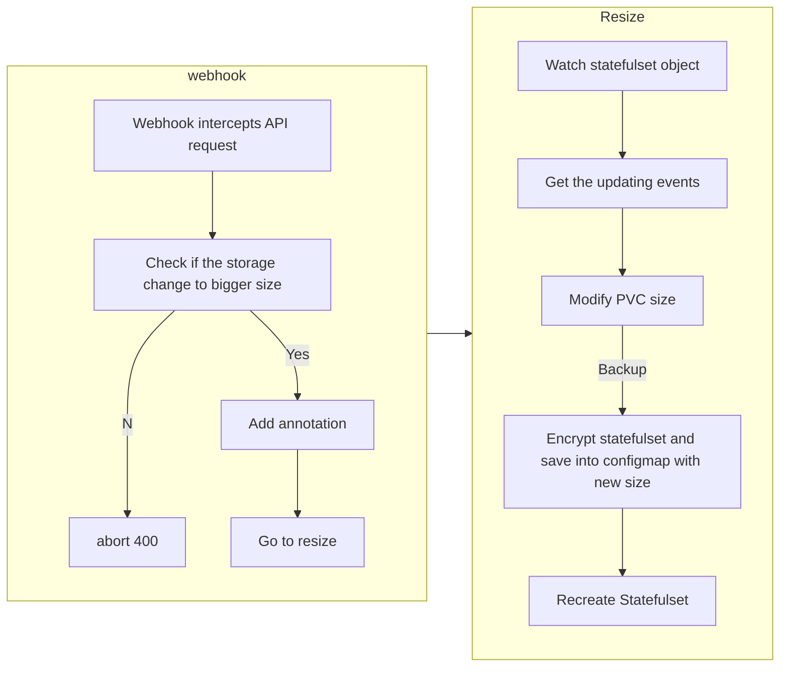

# Self Introduction
嗨！我是彭謙，是一位軟體工程師，畢業於國立台灣科技大學資訊工程研究所。在碩士期間，我致力於研究 transformer 模型，並在碩士論文中深入探討了這一主題。除此之外，我也擁有一年的 SRE 軟體工程師實習經驗，期間學到了許多關於容器化技術和自動化開發的知識。

在我的職業生涯中，我專注於學習並成長。在實習期間，我掌握了 Kubernetes 和 Azure DevOps 用於部署應用程序的技能，並且積極參與了 Chatbot 智慧客服等項目，進一步提升了我的技術水平。此外，我也獲得了實作自動化更新服務 IP、以及使用 Python 開發 Kubernetes 運維工具的經驗。

在工作之餘，我繼續保持著對技術的熱情。去年，我加入了一個讀書會，與朋友一起學習 Rust 語言，並成功使用 Rust 實作了 Head First Design Pattern 書中的示例。目前，我正在學習 NestJS 框架，並負責讀書會的 Kubernetes 和 Google Cloud Platform 內容。

我希望未來能夠接觸更多具有挑戰性的項目，並與優秀的同事們合作，共同學習和成長。

Hi there! My name is Peng Chien, and I'm a software engineer. I graduated from the Institute of Information Engineering at National Taiwan University of Science and Technology. During my master's program, I focused on researching transformer models and delved deep into this topic for my thesis. Additionally, I have one year of experience as a Software Engineer in Site Reliability Engineering (SRE), where I gained knowledge in containerization technologies and automated development.

Throughout my career, I have been committed to continuous learning and growth. During my internship, I acquired skills in Kubernetes and Azure DevOps for application deployment, and actively participated in projects like Chatbot intelligent customer service to further enhance my technical capabilities. Moreover, I gained experience in implementing automated updates for service IPs and developing operational tools for Kubernetes using Python.

Outside of work, I maintain a passion for technology. Last year, I joined a study group where I learned Rust with friends and successfully implemented examples from the Head First Design Patterns book using Rust. Currently, I am learning the NestJS framework and responsible for Kubernetes and Google Cloud Platform content in the study group.

I look forward to tackling more challenging projects in the future and collaborating with talented colleagues to continue learning and growing together.


# Skills

### DevOps

- Kubernetes
  - K8S deploy and manage applications.

  - Helm chart & helmfile.

  - K8S operator by using python.
  
- Terraform
  - IaC

### Cloud Service
- Azure
  - Azure DevOps Service
  - Git repo
  - CI/CD
  - Azure portal
  - AKS
- Google Cloud
  - VM
  - docker container
  - Google Kubernetes Engine
### Backend
- Python
  - Experience in Python development in many projects
  - Flask api

- Rust
  - Implementing "Head First Design Pattern" by using rust lang.
  - oop

- MySQL# Experience
### Software Engineer Intern, Westpharma, Taipei, Taiwan 
Sure, here is a revised version of your project description:

**Aug 2022 - Jul 2023**

1. **IoT ChatBot**
   - **Description:** Developed a conversational AI tailored for IoT documentation inquiries, capable of storing chat history and autonomously handling up to 30% of customer service queries.
   - **Tech Stack:** Python, Flask API, LangChain, Docker, React

2. **Automated Resizing PVC Disk**
   - **Description:** Addressed the challenge of unchangeable disk sizes in statefulset volume claims by implementing automated monitoring and resizing based on usage.
   - **Tech Stack:** Python, Kubernetes Operator, Docker

3. **Automatic RecordSet Updater**
   - **Description:** Designed a solution to manage and update Service and Ingress IPs in Azure RecordSets at regular intervals, effectively mitigating common IP change issues encountered in Kubernetes deployments.
   - **Tech Stack:** Shell, Azure DevOps, Kubernetes

These projects demonstrate my expertise in developing scalable solutions using technologies such as Kubernetes, Azure DevOps, Docker, and Python. They also highlight my ability to address real-world challenges in areas like conversational AI, automated monitoring, and infrastructure management.# Education
**Master of Science in Computer Science**
*National Taiwan University of Science and Technology, 2021-2023*
- **Thesis Topic:** "Implementing Popular Music to Piano Music Transformation Using Transformer"
- **Supervisor:** Prof. Hong
- **Description:** Conducted research on music transformation utilizing Transformer models, focusing on data preprocessing and model optimization. Developed expertise in deep learning and data science.

**Bachelor of Science in Computer Science**
*National Taipei University, 2016-2020*# Automatically Update Statefulset


---
This project implements an operator using the Python k8s-client to automatically update the disk storage of StatefulSet PersistentVolumeClaims (PVCs). It completely resolves the issue of being unable to modify PVC storage, and once deployed, you will never need to worry about capacity issues.


## Workflow


### Operator Structure
```
<Operator-name>
├── Dockerfile
├── requirements.txt
├── <operator>.py
├── azure_pipelines.yaml
└── chart
    ├── Chart.yaml
    ├── azure_pipelines.yaml
    ├── values.yaml
    └── templates
        └── ...
```

## Setup steps

Each operator needs to build an image and deploy it to Kubernetes.

**1. [Webhook](https://github.com/pong1013/resize-statefulset-operator/tree/main/webhook)**

**2. [Manually resize](https://github.com/pong1013/resize-statefulset-operator/tree/main/main-resize-operator)**

**3. [Automatically resize](https://github.com/pong1013/resize-statefulset-operator/tree/main/auto-resize-operator)**

# Automatically Resize Operator

This Python script operator is designed to automatically update the size of the PersistentVolumeClaims (PVCs) associated with StatefulSets (STS) based on the disk usage within the pods.

### How to resize automatically?
Add annotation with true:

`"resize-statefulset-operator/auto-scaled": "true"`


## Setup
**1. Install Crossplane CRDs**

- To monitor and modify StatefulSets across all namespaces, we need to install Crossplane. Crossplane extends Kubernetes with Custom Resource Definitions (CRDs) and controllers, allowing us to define infrastructure resources as Kubernetes objects. 

- [Crossplane](https://marketplace.upbound.io/providers/upbound/provider-azure/v0.19.0/docs)


**2. Add local config**

- Using a local kubeconfig allows you to execute `auto.py` locally to test if the operator is running smoothly. Once you've confirmed there are no issues, you can then build the image and deploy it to Kubernetes.
  ```python
  # local load kubeconfig
  config.load_kube_config("PATH TO KUBECONFIG")
  ```

**3. Build Image**

- You can use `Docker` or `Azure Pipeline` to build image

**4. Deploy to k8s**

- `helm install auto-resize ./`


## Workflow
```mermaid
graph TD;
    A[Start] --> B{Watch for StatefulSet changes};
    B --> C[Process StatefulSet events];
    C --> D{Check PVCs and disk usage};
    D --> |Disk usage exceeds threshold| E[Adjust PVC size];
    D --> |Disk usage is normal| B
    E --> G[Update PVC size in StatefulSet object];
    G --> H[Patch StatefulSet in Kubernetes API];
    H --> B;
```# Manually Resize Operator
This Python script operator monitors StatefulSets across all namespaces in a Kubernetes cluster and adjusts the size of their PersistentVolumeClaims (PVCs) based on annotations provided in the StatefulSet metadata.

### How to resize manually?
Add annotation with new size:
- `"resize-statefulset-operator/resize-{vc}": "10Gi"` -> `"resize-statefulset-operator/resize-0": "10Gi"`
- ‼️Statefulset may has several vc template, so we need to specify the no. of vc.

## Setup
**1. Install Crossplane CRDs**

- To monitor and modify StatefulSets across all namespaces, we need to install Crossplane. Crossplane extends Kubernetes with Custom Resource Definitions (CRDs) and controllers, allowing us to define infrastructure resources as Kubernetes objects. 

- [Crossplane](https://marketplace.upbound.io/providers/upbound/provider-azure/v0.19.0/docs)

**2. Add local config**

- Using a local kubeconfig allows you to execute `resize-sts-operator.py` locally to test if the operator is running smoothly. Once you've confirmed there are no issues, you can then build the image and deploy it to Kubernetes.
  ```python
  # local load kubeconfig
  config.load_kube_config("PATH TO KUBECONFIG")
  ```

**3. Build Image**

- You can use `Docker` or `Azure Pipeline` to build image

**4. Deploy to k8s**

- `helm install resize-statefulset-operator ./`


## Workflow
```mermaid
graph TD;
    A[Start] --> B{StatefulSet Change Event?};
    B -- Yes --> C[Retrieve StatefulSet Information];
    C --> D{PVC Resizing Annotations Present?};
    D -- Yes --> E[Compare Requested Size with Current Size];
    E -- Size Adjustment Necessary --> F[Update PVC Size];
    F --> G[Create or Update ConfigMap];
    G --> H[Delete Original StatefulSet];
    H --> I[Create New StatefulSet];
    I --> B;
    D -- No --> B;
```# Webhook Operator
This webhook server defines a Flask web application that acts as an admission controller for Kubernetes. The admission controller intercepts requests to create or update StatefulSet objects in Kubernetes and modifies them based on predefined logic.

If you want to become familiar with k8s webhook. I recommand this page by [Kristijan Mitevsk](https://kmitevski.com/kubernetes-mutating-webhook-with-python-and-fastapi/)


## Setup Webhook
**1. Generate SAN Cert**

- Generate your own SAN cert in */cert* folder.([here](https://github.com/pong1013/resize-statefulset-operator/tree/main/webhook/cert))

**2. Add local config**

- Using a local kubeconfig allows you to execute `webhook.py` locally to test if the operator is running smoothly. Once you've confirmed there are no issues, you can then build the image and deploy it to Kubernetes.
  ```python
  # local load kubeconfig
  config.load_kube_config("PATH TO KUBECONFIG")
  ```

**3. Build Image**

- You can use `Docker` or `Azure Pipeline` to build image

**4. Deploy to k8s**

- `helm install webhook ./`


## Workflow
```mermaid
graph TD;
    B[Receive Admission Request] --> C[Extract StatefulSet Object];
    C --> D[Check Volume Claim Templates];
    D -- Yes --> E[Iterate Over Templates];
    E -- Compare Sizes --> F[Construct Patch List and Encode];
    D -- No --> I[Return Admission Response];
    F --> I;
```