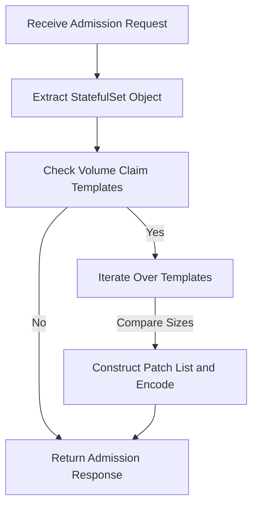

# Automatically Resize Operator

This Python script operator is designed to automatically update the size of the PersistentVolumeClaims (PVCs) associated with StatefulSets (STS) based on the disk usage within the pods.

### How to resize automatically?
Add annotation with true:

`"resize-statefulset-operator/auto-scaled": "true"`


## Setup
**1. Install Crossplane CRDs**

- To monitor and modify StatefulSets across all namespaces, we need to install Crossplane. Crossplane extends Kubernetes with Custom Resource Definitions (CRDs) and controllers, allowing us to define infrastructure resources as Kubernetes objects. 

- [Crossplane](https://marketplace.upbound.io/providers/upbound/provider-azure/v0.19.0/docs)


**2. Add local config**

- Using a local kubeconfig allows you to execute `auto.py` locally to test if the operator is running smoothly. Once you've confirmed there are no issues, you can then build the image and deploy it to Kubernetes.
  ```python
  # local load kubeconfig
  config.load_kube_config("PATH TO KUBECONFIG")
  ```

**3. Build Image**

- You can use `Docker` or `Azure Pipeline` to build image

**4. Deploy to k8s**

- `helm install auto-resize ./`


## Workflow
```mermaid
graph TD;
    A[Start] --> B{Watch for StatefulSet changes};
    B --> C[Process StatefulSet events];
    C --> D{Check PVCs and disk usage};
    D --> |Disk usage exceeds threshold| E[Adjust PVC size];
    D --> |Disk usage is normal| B
    E --> G[Update PVC size in StatefulSet object];
    G --> H[Patch StatefulSet in Kubernetes API];
    H --> B;
```# Manually Resize Operator
This Python script operator monitors StatefulSets across all namespaces in a Kubernetes cluster and adjusts the size of their PersistentVolumeClaims (PVCs) based on annotations provided in the StatefulSet metadata.

### How to resize manually?
Add annotation with new size:
- `"resize-statefulset-operator/resize-{vc}": "10Gi"` -> `"resize-statefulset-operator/resize-0": "10Gi"`
- ‼️Statefulset may has several vc template, so we need to specify the no. of vc.

## Setup
**1. Install Crossplane CRDs**

- To monitor and modify StatefulSets across all namespaces, we need to install Crossplane. Crossplane extends Kubernetes with Custom Resource Definitions (CRDs) and controllers, allowing us to define infrastructure resources as Kubernetes objects. 

- [Crossplane](https://marketplace.upbound.io/providers/upbound/provider-azure/v0.19.0/docs)

**2. Add local config**

- Using a local kubeconfig allows you to execute `resize-sts-operator.py` locally to test if the operator is running smoothly. Once you've confirmed there are no issues, you can then build the image and deploy it to Kubernetes.
  ```python
  # local load kubeconfig
  config.load_kube_config("PATH TO KUBECONFIG")
  ```

**3. Build Image**

- You can use `Docker` or `Azure Pipeline` to build image

**4. Deploy to k8s**

- `helm install resize-statefulset-operator ./`


## Workflow
```mermaid
graph TD;
    A[Start] --> B{StatefulSet Change Event?};
    B -- Yes --> C[Retrieve StatefulSet Information];
    C --> D{PVC Resizing Annotations Present?};
    D -- Yes --> E[Compare Requested Size with Current Size];
    E -- Size Adjustment Necessary --> F[Update PVC Size];
    F --> G[Create or Update ConfigMap];
    G --> H[Delete Original StatefulSet];
    H --> I[Create New StatefulSet];
    I --> B;
    D -- No --> B;
```# Automatically Update Statefulset


---
This project implements an operator using the Python k8s-client to automatically update the disk storage of StatefulSet PersistentVolumeClaims (PVCs). It completely resolves the issue of being unable to modify PVC storage, and once deployed, you will never need to worry about capacity issues.


## Workflow
```mermaid
flowchart LR

    subgraph Resize
    direction TB
    E[Watch statefulset object] --> F[Get the updating events]
    F --> G[Modify PVC size];
    G --Backup--> H[Encrypt statefulset and save into configmap with new size]
    H --> I[Recreate Statefulset]
    end;

    subgraph webhook
    direction TB
    A[Webhook intercepts API request] --> B[Check if the storage change to bigger size];
    B --Yes--> C[Add annotation];
    B --No--> D[abort 400];
    C --> X[Go to resize];
    end;
    webhook --> Resize
    
```

### Operator Structure
```
<Operator-name>
├── Dockerfile
├── requirements.txt
├── <operator>.py
├── azure_pipelines.yaml
└── chart
    ├── Chart.yaml
    ├── azure_pipelines.yaml
    ├── values.yaml
    └── templates
        └── ...
```

## Setup steps

Each operator needs to build an image and deploy it to Kubernetes.

**1. [Webhook](https://github.com/pong1013/resize-statefulset-operator/tree/main/webhook)**

**2. [Manually resize](https://github.com/pong1013/resize-statefulset-operator/tree/main/main-resize-operator)**

**3. [Automatically resize](https://github.com/pong1013/resize-statefulset-operator/tree/main/auto-resize-operator)**

# Webhook Operator
This webhook server defines a Flask web application that acts as an admission controller for Kubernetes. The admission controller intercepts requests to create or update StatefulSet objects in Kubernetes and modifies them based on predefined logic.

If you want to become familiar with k8s webhook. I recommand this page by [Kristijan Mitevsk](https://kmitevski.com/kubernetes-mutating-webhook-with-python-and-fastapi/)


## Setup Webhook
**1. Generate SAN Cert**

- Generate your own SAN cert in */cert* folder.([here](https://github.com/pong1013/resize-statefulset-operator/tree/main/webhook/cert))

**2. Add local config**

- Using a local kubeconfig allows you to execute `webhook.py` locally to test if the operator is running smoothly. Once you've confirmed there are no issues, you can then build the image and deploy it to Kubernetes.
  ```python
  # local load kubeconfig
  config.load_kube_config("PATH TO KUBECONFIG")
  ```

**3. Build Image**

- You can use `Docker` or `Azure Pipeline` to build image

**4. Deploy to k8s**

- `helm install webhook ./`


## Workflow
